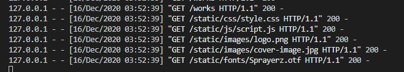
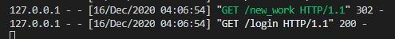
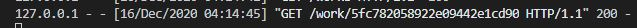

# Testing | Bristol Blackbook

## Automated Testing

jshint.com

### PEP8 
http://pep8online.com/

    

## Manual Testing

First I ran through each of my user stories to check they worked.

- As a user, I want a site to have a clearly defined purpose when I first enter so that I know what I am viewing.
    - The main landing page describes exactly what the site is for.

- As a user, I want to register for an account so that I can contribute to the database.
    - The Register button is clearly displayed on the navbar.
    - Registration functionality works, as demonstrated below.

- As a user, I want to be able to browse all works in the db.
    - The home page from the navbar displays all works uploaded to the db.

- As a user, I want to clearly see the artist name, style, type and year painted for each work.
    - When hovering the mouse over an image thumbnail on the main works page, all info is diaplayed.
    - If an image is clicked, a page containing the image in large scale along with all info is clearly displayed.

- As a user, I want to be able to easily browse all individual artists, crews, styles amd types in the db.
    - The navbar displays links to pages displaying each of these items.
    - Each page lists all of the items within the db clearly.

- As a user, I want to see how to add content, so that I can easily contribute to the database.
    - Each page has a button to add an item of that sort to the database.
    - Users logged in will see these links on the navbar.

- As a user, I want to see what I have uploaded to the database, so that I can track my contributions.
    - When users sign in, they are shown their profile page. This shows a concise list of all their uploaded contributions.

- As a registered user, I want control over my data, so that I can easily choose to delete the account or any content I have uploaded to the website.
    - The option to delete a users account is displayed on their user panel.
    - All items they have uploaded will display buttons allowing them to edit/delete it.

- As a user, I want all functionality on the site to work to avoid a bad experience.
    - All functionality works as expected. Please see further testing below.

Page 200 codes

## All Users Pages

- /welcome - OK
- /login - OK
- /register - OK
- /works - OK
- /artists - OK
- /crews - OK
- /styles - OK
- /types - OK

    

- /work/ObjectID - OK
- /artist/artist_name - OK
- /crew/crew_name - OK
- /style/style_name - OK
- /type/type_name - OK

    

## Registered User Pages

- /profile/username - OK
- /new_work - OK
- /add_artist - OK
- /add_crew - OK
- /add_style - OK
- /add_type - OK

    

- /edit_work/ObjectID - OK
- /edit_artist/artist_name - OK
- /edit_crew/crew_name - OK
- /edit_style/style_name - OK
- /edit_type/type_name - OK

    

302 authentication redirects

    

form validation

buttons

links 

### Artist Pages
### Crew Pages
### Style Pages
### Type Pages
### Login
### Register
### Profile
### Admin Panel

## 1 Pages

### Welcome

- I tested that both ('/') and ('/welcome') GET requests returned the correct HTML file with a 200 status code.

    

- I tested the ENTER button takes the user to the ('/works') route.

- I tested page content and responsiveness at all sizes

### Works Page

- I tested that the ('/works') GET request returned the correct HTML file with a 200 status code on all loaded content.

    

- I tested the pagination, checking the correct query parameter was passed for each page.

    

- I tested page content and responsiveness at all sizes

- I tested the search box, making sure that artist names were returning correct results.

- I tested the Add Work button correctly works and that it redirected users not logged in with a 302 code.

    

### Work Page

- I tested that the ('/work/ObjectID') GET request returned the correct HTML file with a 200 status code on all loaded content.

    

- I checked that each piece of info was loaded.
